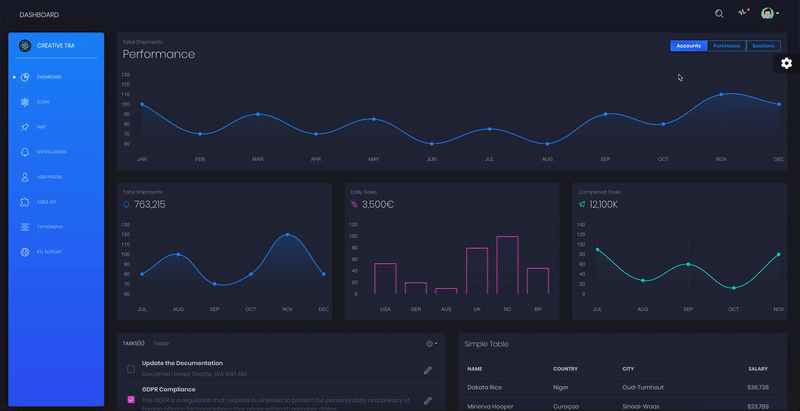

# [IoT Dashboard React](https://demos.creative-tim.com/black-dashboard-react/#/dashboard) 

  

IoT Dashboard React is a beautiful [Bootstrap 4](http://getbootstrap.com/), [Reacstrap](https://reactstrap.github.io/) and [React](https://reactjs.org/) ([create-react-app](https://github.com/facebook/create-react-app)) Admin Dashboard with a huge number of components built to fit together and look amazing. If you are looking for a tool to manage and visualize data about your business, this dashboard is the thing for you. It combines colors that are easy on the eye, spacious cards, beautiful typography, and graphics.

IoT Dashboard React comes packed with all plugins that you might need inside a project and documentation on how to get started. It is light and easy to use, and also very powerful.

Black Dashboard React fetches data from CSV files, parse data and visualize it using Chart.js

Special thanks go for the owners of these plugins:
- [Perfect Scrollbar](http://utatti.github.io/perfect-scrollbar/) for the nice scrollbars for windows.
- [React Chartjs](http://jerairrest.github.io/react-chartjs-2/) for the wonderful wrapper for charts.
- [Chartjs](https://www.chartjs.org/) for the wonderful charts.

I am very excited to share this dashboard with you and we look forward to hearing your feedback!

At present, we officially aim to support the last two versions of the following browsers:

    

## Reporting Issues
I use GitHub Issues as the official bug tracker for the Black Dashboard React. Here are some advices for our users that want to report an issue:

If you have questions or need help integrating the product please [contact me](https://www.monujohn.com)

- Copyright 2020 Creative Tim (https://www.creative-tim.com)
- Licensed under MIT (https://github.com/creativetimofficial/black-dashboard-react/blob/master/LICENSE.md)
